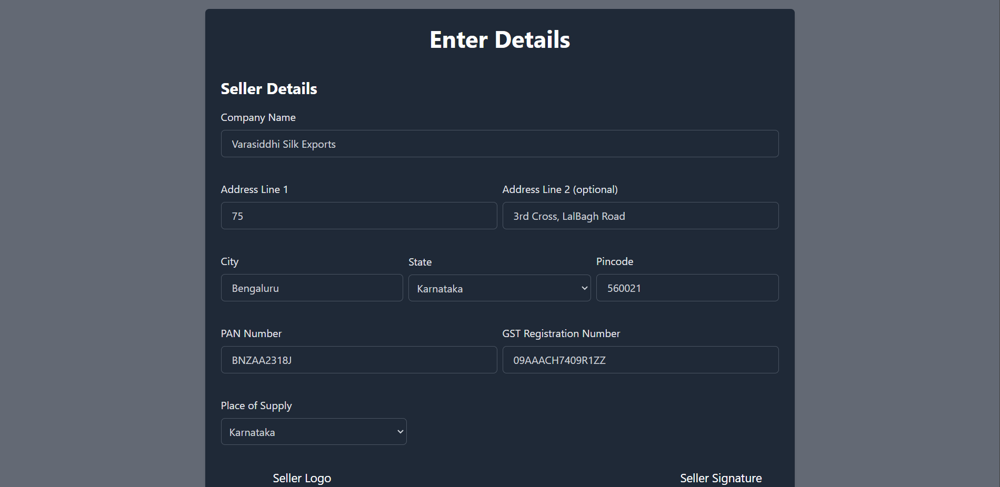
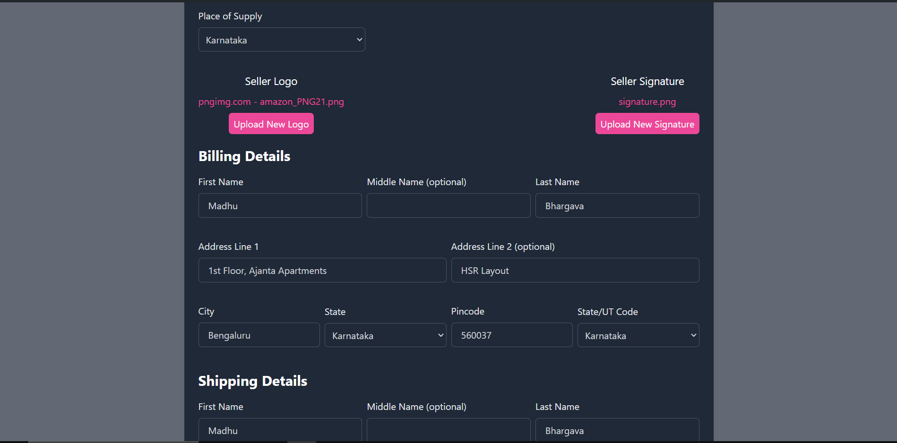
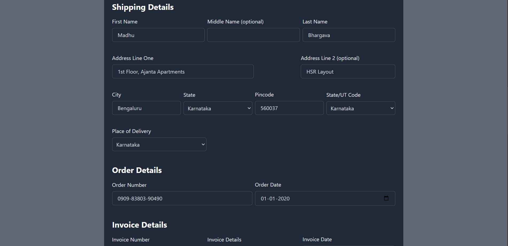
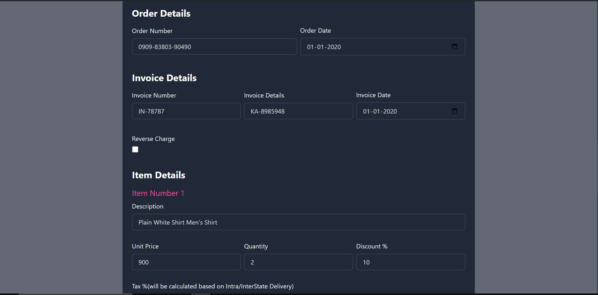
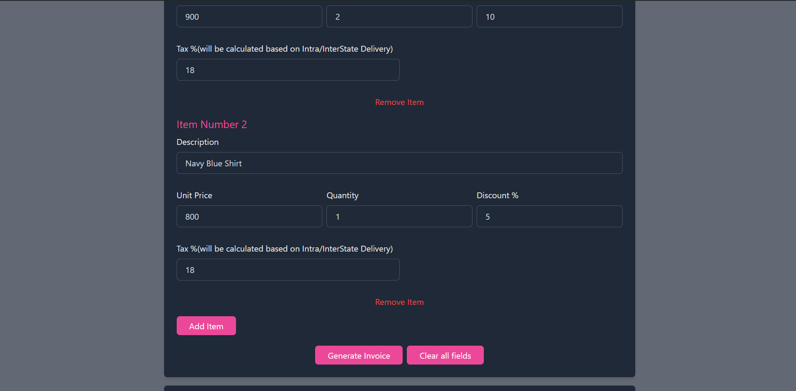
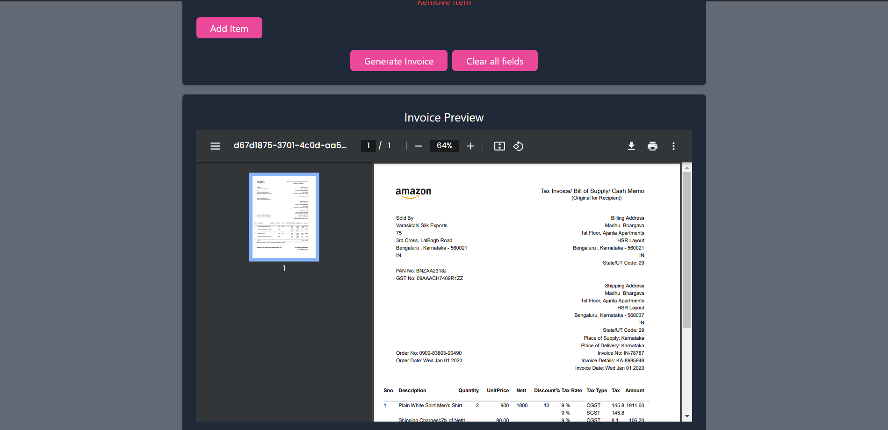

# E-commerce Invoice Generator

## Objective

The goal of this project is to develop a programmatic solution for generating invoices for orders placed on an e-commerce platform. The invoice format and structure are designed to match Amazon's Invoice template as closely as possible.

## Tech Stack

- **Frontend:** React, Tailwind CSS
- **Backend:** Node.js, Express
- **Libraries Used:**
  - **Frontend:** 
    - `yup` for schema validation
    - `react-hook-form` for complex form management
    - `nanoid` for generating unique IDs
  - **Backend:** 
    - `pdfkit` for PDF generation
    - `num2words` for converting numbers to words

## Features

- **Dynamic Invoice Generation:** Creates invoices based on provided order and seller details.
- **Layout** Can add your own company logo and your e-signature
- **PDF Generation:** Generates PDF which is downloaded to your local machine and Preview invoices in PDF format.
- **Schema Validation:** Uses `yup` for validating input data.
- **Data Validation** Data Validation at backend
- **PDF Customization:** Customize PDF layout including seller logo, signature, and itemized details.
- **Amount in Words:** Converts numerical amounts into words using `num2words`.

## Installation
- make a folder -> `mkdir invoice`
- open a terminal
- git clone this repository -> `git clone <repo-url> ./`
- navigate to client folder `cd client`
  - `npm install`
  - Run the app - `npm run start`
- navigate to client folder `cd client`
  - `npm install`
  - Run the server - `npm run start`

